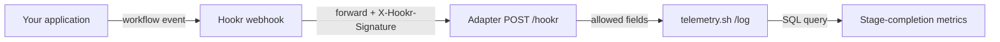

<Note>
  This is a community example contributed by the telemetry.sh team. It has been
  tested locally only - it has not been deployed or exercised against the hosted
  services, and it is not an official or natively supported Hookr integration.
  Review the code and run it in a dedicated test workspace before relying on it.
</Note>

## Overview

This integration uses Hookr [Forwarding](/features/forwarding-proxying) to relay a small,
fixed set of workflow event fields to [telemetry.sh](https://telemetry.sh). Once the events
land in a telemetry.sh table, you can query stage-completion metrics (counts and average
durations) across many workflow runs.

It complements - rather than replaces - Hookr's push notifications and event history. Hookr
still shows individual events and forwarding results; telemetry.sh adds an aggregate view.

## How it works

A small adapter service sits between Hookr and telemetry.sh:

1. Your application sends a workflow event to a Hookr webhook.
2. Hookr forwards the raw payload to the adapter, signed with `X-Hookr-Signature`.
3. The adapter verifies the signature, validates the event, and forwards only the allowed
   fields to the telemetry.sh Log API.
4. You query the resulting table to analyze stage completions across runs.



## Prerequisites

- A Hookr webhook with [Forwarding](/features/forwarding-proxying) enabled, and its **forward secret**.
- A [telemetry.sh](https://telemetry.sh) account and an **API key**.
- A host that can run a Node.js service and expose it over public HTTPS.

## Event contract

Your application must send events shaped exactly like this:

```json
{ "event_id": "evt_1", "run_id": "run_1", "stage": "fetch", "outcome": "succeeded", "elapsed_ms": 120 }
```

| Field | Allowed values | Notes |
| --- | --- | --- |
| `event_id` | Opaque string, unique | Use invented, opaque IDs; must be unique across the table. |
| `run_id` | Opaque string | Identifies the workflow run. |
| `stage` | `fetch`, `transform`, `deliver` | Application-defined stage. |
| `outcome` | `succeeded`, `failed` | Result of the stage. |
| `elapsed_ms` | Nonnegative integer | Application-measured duration, not forwarding latency. |

Only these five fields are forwarded onward. Everything else in the payload is dropped.

<Warning>
  An allowlist does not make values safe. Never put customer identifiers, secrets, or other
  sensitive data in these fields.
</Warning>

## Setup

<Steps>
  <Step title="Configure secrets">
    Provide the adapter with server-side secrets. Do not paste real credentials into the source
    files.

    - `HOOKR_FORWARD_SECRET` - your webhook's forward secret
    - `TELEMETRY_API_KEY` - your telemetry.sh API key
    - `HOOKR_ADAPTER_PORT` - optional, defaults to `8080`
  </Step>
  <Step title="Run the adapter">
    Start the adapter service:

    ```bash
    node server.mjs
    ```

    The server listens only on `127.0.0.1`. It accepts `POST /hookr` with a JSON body and rejects
    other methods, paths, and compressed bodies. It buffers at most 16 KiB per request and limits
    concurrency.
  </Step>
  <Step title="Expose it over HTTPS">
    Because the adapter binds to loopback only, put it behind a public HTTPS reverse proxy that
    forwards to `/hookr`, with suitable connection limits and monitoring. No public endpoint is
    included or deployed for you.
  </Step>
  <Step title="Point Hookr at the adapter">
    In your Hookr webhook's Forwarding settings, set a destination URL that resolves to your
    proxy's `/hookr` endpoint, and confirm the forward secret matches `HOOKR_FORWARD_SECRET`.
  </Step>
</Steps>

## Verify

Using invented data in a dedicated test workspace:

1. Forward one event through Hookr and inspect the forwarding response.
2. Query the telemetry.sh table until the event is visible within a bounded wait.
3. Test a rejected event and an ambiguous timeout separately.

The adapter returns `204` after an upstream `2xx`. This means HTTP acceptance, not proven durable
storage or immediate query visibility. Upstream failure or timeout returns an empty `502`.

## Analyzing results

The example includes an analysis query that collapses repeated event IDs, excludes conflicting
IDs, and groups recorded completions by `stage` and `outcome` with an average duration. Note that
it measures recorded completions only - a run without a completion event is absent, so the result
is not a workflow success rate.

## Security notes

- **Only five fields leave the adapter.** Arbitrary payload properties, headers, and source
  credentials are never forwarded.
- **`204` is not durability.** A timeout can occur after acceptance; the example does not implement
  a durable queue, replay protection, or exactly-once delivery.
- **No automatic retry.** Investigate using the stable `event_id` before manually replaying.
- **The body signature authenticates bytes, not freshness.** Repeated authentic payloads remain
  possible.

## Full source

The complete adapter, server, ingestion client, analysis SQL, and local tests are available in the
contributor's source package:

<Card title="Hookr → telemetry.sh source draft" icon="github" href="https://gist.github.com/TheBuilderJR/8a3be701daa53a6af622d206033326a8">
  Full source and local tests (Node and Python standard libraries only). All credentials in tests
  are invented fixtures.
</Card>

For the telemetry.sh Log API, see the [telemetry.sh documentation](https://telemetry.sh/docs/api-reference/log).
